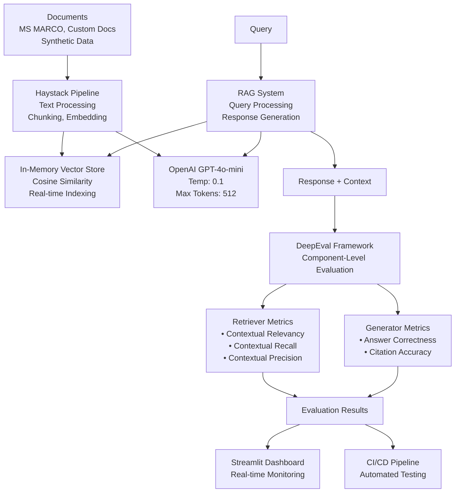

# RAG Evaluation POC with DeepEval & GPT-4o-mini

[](https://github.com/samarthindex9/Deepeval_RAG)
[](https://github.com/samarthindex9/Deepeval_RAG/actions)
[](https://python.org)
[](https://docs.confident-ai.com)
[](https://openai.com)

A comprehensive **production-ready** RAG (Retrieval-Augmented Generation) evaluation system using **DeepEval framework** with **14+ specialized metrics**, **OpenAI GPT-4o-mini**, and automated **CI/CD pipeline** for continuous quality assurance.

## Architecture



**Components:**
- **Documents**: MS MARCO dataset, custom docs, synthetic data
- **Haystack Pipeline**: 
  - Document processing (PDF/DOC/TXT)
  - Text chunking (500 chars, 50 overlap)
  - Sentence Transformers embedding (384-dim)
- **In-Memory Vector Store**: Cosine similarity search, real-time indexing
- **OpenAI GPT-4o-mini**: Temperature 0.1, max 512 tokens
- **RAG System**: Query processing and response generation
- **DeepEval Framework**: Component-level evaluation with 14+ metrics
- **Results**: Real-time dashboard and automated CI/CD monitoring

**Evaluation Metrics:**
- **Retriever Metrics**:
  - Contextual Relevancy: Are retrieved contexts relevant to the query?
  - Contextual Recall: Is all relevant information retrieved?
  - Contextual Precision: How precise is the retrieval without noise?
- **Generator Metrics**:
  - Answer Correctness: Factual accuracy of generated responses
  - Citation Accuracy: Proper attribution to source documents

##  Quick Start

### Prerequisites
- Python 3.9+
- OpenAI API key
- Git for version control

### Installation

1. **Clone and setup environment:**
```bash
git clone https://github.com/samarthindex9/Deepeval_RAG.git
cd RAG-Deepeval
pip install -r requirements.txt
```

2. **Set up OpenAI API key:**
```bash
# Copy environment file
cp .env.example .env

# Edit .env and add your OpenAI API key
export OPENAI_API_KEY=your-api-key-here
```

3. **Run evaluation:**
```bash
# Quick test with sample data
python src/main.py --dataset sample --size 5

# Full MS MARCO evaluation
python src/main.py --dataset ms_marco --size 100
```

4. **Launch monitoring dashboard:**
```bash
streamlit run src/dashboard.py
```

##  **Evaluation Metrics**

###  **Retriever Metrics** (Component-Level)
- **Contextual Relevancy**: Measures if retrieved contexts are relevant to the query
- **Contextual Recall**: Evaluates if all relevant information is retrieved  
- **Contextual Precision**: Assesses precision of the retrieval system

###  **Generator Metrics** (Component-Level)
- **Answer Correctness**: Custom GEval metric for factual accuracy
- **Citation Accuracy**: Custom GEval metric for proper source attribution

###  **Advanced Features**
- **Synthetic Data Generation**: DeepEval Synthesizer creates additional test cases
- **Component Isolation**: Separate evaluation of retriever vs generator
- **Regression Detection**: Automated performance monitoring over time

##  **Testing Framework**

### Unit & Integration Tests
```bash
# Run all tests
pytest

# Run with coverage
pytest --cov=src --cov-report=html

# Run specific test categories
pytest -m "not slow"  # Quick tests only
pytest -m "integration"  # Integration tests
```

### Test Categories
- **Unit Tests**: Individual component testing
- **Integration Tests**: End-to-end RAG pipeline testing
- **Performance Tests**: Latency and throughput validation

## 📈 **Monitoring & Observability**

### Real-time Dashboard
- **Performance Metrics**: Live tracking of evaluation scores
- **Trend Analysis**: Historical performance visualization
- **Alert System**: Automatic notifications for performance degradation
- **Interactive Controls**: Real-time configuration and testing

### Production Monitoring
- **Drift Detection**: Automatic detection of model performance changes
- **A/B Testing**: Side-by-side comparison of different RAG configurations
- **Custom Metrics**: Extensible framework for domain-specific evaluation

##  **CI/CD Pipeline**

### GitHub Actions Workflow
```yaml
# Automated on every push/PR
- RAG Evaluation: Comprehensive metric calculation
- Performance Regression: Compare against baseline
- Quality Gates: Block deployment if metrics degrade
- Report Generation: Detailed evaluation reports
```

### Integration Features
- **PR Comments**: Automatic evaluation results in pull requests
- **Slack Notifications**: Team alerts for significant changes
- **Deployment Gates**: Quality-based deployment decisions

##  **Configuration**

### RAG System Configuration (`config/rag_config.yaml`)
```yaml
llm:
  provider: "openai"
  model_name: "gpt-4o-mini"
  temperature: 0.1
  max_tokens: 512

embeddings:
  model_name: "sentence-transformers/all-MiniLM-L6-v2"
  dimension: 384

vector_db:
  provider: "in_memory"
  collection_name: "rag_documents"
```

### Evaluation Configuration (`config/eval_config.yaml`)
```yaml
evaluation:
  model: "gpt-4"
  max_test_cases: 100
  
retriever_metrics:
  contextual_relevancy:
    threshold: 0.7
  contextual_recall:
    threshold: 0.8
    
generator_metrics:
  answer_correctness:
    criteria: "Factual accuracy and completeness"
    threshold: 0.75
```
##  **Project Structure**

```
RAG-Deepeval/
├──  config/                 # Configuration files
│   ├── rag_config.yaml       # RAG system settings
│   └── eval_config.yaml      # Evaluation parameters
├──  src/                    # Source code
│   ├── rag/                  # RAG system implementation
│   │   ├── components.py     # Custom Haystack components
│   │   ├── pipeline.py       # RAG pipeline orchestration
│   │   └── rag_system.py     # Main RAG system class
│   ├── evaluation/           # DeepEval framework integration
│   │   ├── deepeval_framework.py  # Core evaluation logic
│   │   ├── metrics.py        # Custom metrics implementation
│   │   ├── test_cases.py     # Test case management
│   │   └── synthetic_data.py # Synthetic data generation
│   ├── data/                 # Data management
│   │   ├── dataset_manager.py     # Dataset loading/processing
│   │   ├── ms_marco_loader.py     # MS MARCO specific loader
│   │   └── document_processor.py  # Document processing utilities
│   ├── monitoring/           # Monitoring and visualization
│   │   ├── dashboard.py      # Streamlit dashboard
│   │   └── metrics_tracker.py     # Performance tracking
│   └── main.py              # Main execution script
├──  tests/                  # Comprehensive test suite
│   ├── test_rag_system.py   # RAG system tests
│   └── test_deepeval_framework.py  # Evaluation tests
├──  .github/workflows/     # CI/CD automation
│   └── rag_evaluation.yml   # GitHub Actions workflow
├──  data/                   # Sample datasets
├──  reports/               # Evaluation reports
├──  docs/                   # Documentation
└──  .env.example           # Environment template
```

##  **Contributing**

1. Fork the repository
2. Create a feature branch (`git checkout -b feature/amazing-feature`)
3. Commit changes (`git commit -m 'Add amazing feature'`)
4. Push to branch (`git push origin feature/amazing-feature`)
5. Open a Pull Request

##  **License**

This project is licensed under the MIT License - see the [LICENSE](LICENSE) file for details.

##  **Acknowledgments**

- **DeepEval Team** for the comprehensive evaluation framework
- **Haystack** for the robust RAG pipeline architecture
- **OpenAI** for the powerful GPT-4o-mini model
- **Sentence Transformers** for high-quality embeddings

---

###  **Useful Links**

- [DeepEval Documentation](https://docs.confident-ai.com)
- [Haystack Documentation](https://haystack.deepset.ai)
- [OpenAI API Documentation](https://platform.openai.com/docs)
- [MS MARCO Dataset](https://microsoft.github.io/msmarco/)

---

**Built with for production RAG evaluation** 