# RAG Evaluation POC with DeepEval & GPT-4o-mini

[](https://github.com/samarthindex9/Deepeval_RAG)
[](https://github.com/samarthindex9/Deepeval_RAG/actions)
[](https://python.org)
[](https://docs.confident-ai.com)
[](https://openai.com)

A comprehensive **production-ready** RAG (Retrieval-Augmented Generation) evaluation system using **DeepEval framework** with **13 specialized metrics**, **OpenAI GPT-4o-mini**, and automated **CI/CD pipeline** for continuous quality assurance.

## Architecture

```mermaid
graph TB
    A[Documents<br/>MS MARCO, Custom Docs<br/>Synthetic Data] --> B[Haystack Pipeline<br/>Text Processing<br/>Chunking, Embedding]
    B --> C[In-Memory Vector Store<br/>Cosine Similarity<br/>Real-time Indexing]
    B --> D[OpenAI GPT-4o-mini<br/>Temp: 0.1<br/>Max Tokens: 512]
    
    E[Query] --> F[RAG System<br/>Query Processing<br/>Response Generation]
    F --> C
    F --> D
    F --> G[Response + Context]
    
    G --> H[DeepEval Framework<br/>Component-Level Evaluation]
    H --> I[Retriever Metrics<br/>• Contextual Relevancy<br/>• Contextual Recall<br/>• Contextual Precision]
    H --> J[Generator Metrics<br/>• Answer Correctness<br/>• Citation Accuracy]
    
    I --> K[Evaluation Results]
    J --> K
    K --> L[Streamlit Dashboard<br/>Real-time Monitoring]
    K --> M[CI/CD Pipeline<br/>Automated Testing]
    
    %% New Chunking Evaluation Flow
    B --> N[Chunking Evaluator<br/>• Chunk Coherence<br/>• Chunk Completeness<br/>• Overlap Quality<br/>• Size Consistency<br/>• Semantic Boundaries]
    N --> O[Processing Evaluator<br/>• Text Cleanliness<br/>• Content Preservation<br/>• Format Handling<br/>• Metadata Quality]
    O --> P[Quality Optimization<br/>• Automatic Chunk Optimization<br/>• Quality-based Adjustments<br/>• Performance Monitoring]
    P --> B
    
    %% Enhanced Results
    N --> Q[Chunking Metrics<br/>Real-time Quality Scores]
    O --> Q
    Q --> L
    Q --> K
```



**Components:**
- **Documents**: MS MARCO dataset, custom docs, synthetic data
- **Haystack Pipeline**: 
  - Document processing (PDF/DOC/TXT)
  - Text chunking (500 chars, 50 overlap)
  - Sentence Transformers embedding (384-dim)
- **In-Memory Vector Store**: Cosine similarity search, real-time indexing
- **OpenAI GPT-4o-mini**: Temperature 0.1, max 512 tokens
- **RAG System**: Query processing and response generation
- **DeepEval Framework**: Component-level evaluation with 13 specialized metrics
- **Chunking Evaluator**: Real-time chunking quality assessment
  - Chunk coherence and completeness evaluation
  - Overlap quality and size consistency monitoring
  - Semantic boundary respect validation
- **Processing Evaluator**: Document processing quality assessment
  - Text cleanliness and content preservation
  - Format handling and metadata quality
  - Processing efficiency monitoring
- **Quality Optimization**: Automatic chunk optimization based on evaluation scores
- **Results**: Real-time dashboard and automated CI/CD monitoring

##  **Evaluation Metrics**

###  **Retriever Metrics** (Component-Level)
- **Contextual Relevancy**: Measures if retrieved contexts are relevant to the query
- **Contextual Recall**: Evaluates if all relevant information is retrieved  
- **Contextual Precision**: Assesses precision of the retrieval system

###  **Generator Metrics** (Component-Level)
- **Answer Correctness**: Custom GEval metric for factual accuracy
- **Citation Accuracy**: Custom GEval metric for proper source attribution

###  **Chunking Evaluation Metrics** (Processing-Level)
- **Chunk Coherence**: Evaluates semantic coherence and logical flow within chunks
- **Chunk Completeness**: Assesses if chunks contain complete information units
- **Overlap Quality**: Evaluates quality of chunk overlaps for context preservation
- **Size Consistency**: Monitors chunk size uniformity and consistency
- **Semantic Boundaries**: Checks if chunks respect sentence and paragraph boundaries
- **Text Cleanliness**: Evaluates text formatting and processing quality
- **Content Preservation**: Ensures original meaning is maintained during processing
- **Metadata Quality**: Assesses completeness and accuracy of chunk metadata

###  **Complete Metrics Summary**
**Total: 13 Specialized Metrics**

**Retriever Metrics (3):**
- Contextual Relevancy, Contextual Recall, Contextual Precision

**Generator Metrics (2):**
- Answer Correctness, Citation Accuracy

**Chunking Evaluation Metrics (8):**
- Chunk Coherence, Chunk Completeness, Overlap Quality, Size Consistency, Semantic Boundaries, Text Cleanliness, Content Preservation, Metadata Quality

###  **Advanced Features**
- **Synthetic Data Generation**: DeepEval Synthesizer creates additional test cases
- **Component Isolation**: Separate evaluation of retriever vs generator
- **Regression Detection**: Automated performance monitoring over time
- **Quality Optimization**: Automatic chunk optimization based on evaluation scores
- **Real-time Monitoring**: Live chunking quality assessment during processing

##  **Quick Start**

### Prerequisites
- Python 3.9+
- OpenAI API key
- Git for version control

### Installation

1. **Clone and setup environment:**
```bash
git clone https://github.com/samarthindex9/Deepeval_RAG.git
cd RAG-Deepeval
pip install -r requirements.txt
```

2. **Set up OpenAI API key:**
```bash
# Copy environment file
cp .env.example .env

# Edit .env and add your OpenAI API key
export OPENAI_API_KEY=your-api-key-here
```

4. **Launch monitoring dashboard:**
```bash
streamlit run src/dashboard.py
```

##  **🚀 Execution Commands**

### **Basic RAG Evaluation**
```bash
# Quick evaluation with sample data
python src/main.py --dataset sample --size 10

# Full evaluation with MS MARCO dataset
python src/main.py --dataset ms_marco --size 100

# Custom documents evaluation
python src/main.py --dataset custom --documents path/to/doc1.txt path/to/doc2.pdf
```

### **Chunking Evaluation Commands**
```bash
# Test chunking evaluations directly
python test_chunking_evaluations.py

# Run with chunking evaluations enabled (default)
python src/main.py --dataset sample --size 20

# Run without chunking evaluations (faster)
python src/main.py --dataset sample --size 20 --no-chunking-eval
```

### **Advanced Evaluation Commands**
```bash
# Large-scale evaluation
python src/main.py --dataset ms_marco --size 500

# Evaluation with custom documents
python src/main.py --dataset custom --size 50 --documents data/*.txt

# Save results to specific location
python src/main.py --dataset sample --size 20 --save-results reports/my_eval.json

# Run evaluation without saving results
python src/main.py --dataset sample --size 20 --no-save
```

### **Testing Commands**
```bash
# Run all tests
pytest

# Run specific test categories
pytest -m "not slow"  # Quick tests only
pytest -m "integration"  # Integration tests
pytest tests/test_rag_system.py -v  # Specific test file

# Run with coverage
pytest --cov=src --cov-report=html
```

### **Dashboard Commands**
```bash
# Launch dashboard
streamlit run src/dashboard.py

# Launch with custom port
streamlit run src/dashboard.py --server.port 8502

# Launch in headless mode
streamlit run src/dashboard.py --server.headless true
```

### **Expected Output with Chunking Evaluations**
```bash
python src/main.py --dataset sample --size 5

# Output includes:
🎉 Evaluation completed successfully!

🔍 Chunking Evaluation Results:
  Chunking Quality: 0.847
  Processing Quality: 0.892
  Evaluation Time: 2.34s
  Processing Time: 1.23s
  Total Chunks: 45
  Avg Chunks per Doc: 15.0

📊 Evaluation Summary:
Components Evaluated: retriever, generator
Total Test Cases: 5
Execution Time: 15.67s
Overall Score: 0.823
Performance Grade: Excellent

📈 Component Scores:
  Retriever:
    contextual_relevancy: 0.856
    contextual_recall: 0.789
    contextual_precision: 0.823
  Generator:
    answer_correctness: 0.812
    citation_accuracy: 0.845
```

##  **Monitoring & Observability**

### Real-time Dashboard
- **Performance Metrics**: Live tracking of evaluation scores
- **Trend Analysis**: Historical performance visualization
- **Alert System**: Automatic notifications for performance degradation
- **Interactive Controls**: Real-time configuration and testing

### Production Monitoring
- **Drift Detection**: Automatic detection of model performance changes
- **A/B Testing**: Side-by-side comparison of different RAG configurations
- **Custom Metrics**: Extensible framework for domain-specific evaluation

##  **CI/CD Pipeline**

### GitHub Actions Workflow
```yaml
# Automated on every push/PR
- RAG Evaluation: Comprehensive metric calculation
- Performance Regression: Compare against baseline
- Quality Gates: Block deployment if metrics degrade
- Report Generation: Detailed evaluation reports
```

### Integration Features
- **PR Comments**: Automatic evaluation results in pull requests
- **Slack Notifications**: Team alerts for significant changes
- **Deployment Gates**: Quality-based deployment decisions

##  **Configuration**

### RAG System Configuration (`config/rag_config.yaml`)
```yaml
llm:
  provider: "openai"
  model_name: "gpt-4o-mini"
  temperature: 0.1
  max_tokens: 512

embeddings:
  model_name: "sentence-transformers/all-MiniLM-L6-v2"
  dimension: 384

vector_db:
  provider: "in_memory"
  collection_name: "rag_documents"
```

### Evaluation Configuration (`config/eval_config.yaml`)
```yaml
evaluation:
  model: "gpt-4"
  max_test_cases: 100
  
retriever_metrics:
  contextual_relevancy:
    threshold: 0.7
  contextual_recall:
    threshold: 0.8
    
generator_metrics:
  answer_correctness:
    criteria: "Factual accuracy and completeness"
    threshold: 0.75
```
##  **Project Structure**

```
RAG-Deepeval/
├──  config/                 # Configuration files
│   ├── rag_config.yaml       # RAG system settings
│   └── eval_config.yaml      # Evaluation parameters
├──  src/                    # Source code
│   ├── rag/                  # RAG system implementation
│   │   ├── components.py     # Custom Haystack components
│   │   ├── pipeline.py       # RAG pipeline orchestration
│   │   └── rag_system.py     # Main RAG system class
│   ├── evaluation/           # DeepEval framework integration
│   │   ├── deepeval_framework.py  # Core evaluation logic
│   │   ├── metrics.py        # Custom metrics implementation
│   │   ├── test_cases.py     # Test case management
│   │   └── synthetic_data.py # Synthetic data generation
│   ├── data/                 # Data management
│   │   ├── dataset_manager.py     # Dataset loading/processing
│   │   ├── ms_marco_loader.py     # MS MARCO specific loader
│   │   └── document_processor.py  # Document processing utilities
│   ├── monitoring/           # Monitoring and visualization
│   │   ├── dashboard.py      # Streamlit dashboard
│   │   └── metrics_tracker.py     # Performance tracking
│   └── main.py              # Main execution script
├──  tests/                  # Comprehensive test suite
│   ├── test_rag_system.py   # RAG system tests
│   └── test_deepeval_framework.py  # Evaluation tests
├──  .github/workflows/     # CI/CD automation
│   └── rag_evaluation.yml   # GitHub Actions workflow
├──  data/                   # Sample datasets
├──  reports/               # Evaluation reports
├──  docs/                   # Documentation
└──  .env.example           # Environment template
```

##  **Contributing**

1. Fork the repository
2. Create a feature branch (`git checkout -b feature/amazing-feature`)
3. Commit changes (`git commit -m 'Add amazing feature'`)
4. Push to branch (`git push origin feature/amazing-feature`)
5. Open a Pull Request

